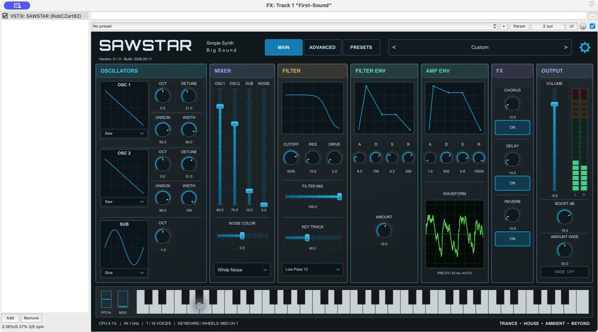
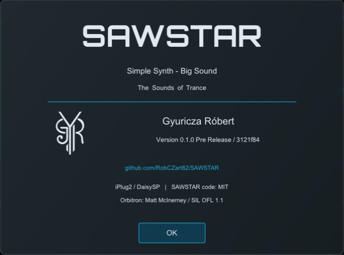

# SAWSTAR

**Simple Synth - Big Sound**

The Sounds of Trance.

An open-source VST3 synthesizer for approachable leads, pads and plucks, with
clear signal flow and a preset browser that explains saved sounds.

*Real development-plugin screenshots in REAPER. These captures precede the RC2
wordmark/About/display-timing refinements; final release captures are pending.*

## Download

**1.0.0 is currently a pre-release candidate, not a published release.**
Candidate artifacts are available from [GitHub Actions](https://github.com/RobCZart82/SAWSTAR/actions).
The final installers will appear on [Releases](https://github.com/RobCZart82/SAWSTAR/releases)
after platform acceptance. See the [candidate record](docs/RELEASE_CANDIDATE_2.md).

## Features

- Two waveform oscillators with 7-layer unison, SUB oscillator, White/Pink/Dark
  noise and independent Noise Color.
- Four-source mixer, filter modes/drive, amp and filter ADSR envelopes.
- Poly/Mono/Legato, glide, pitch/mod wheels, two LFOs and four modulation routes.
- Arpeggiator, chorus, delay, reverb and master stereo width.
- 24 embedded presets: seven Templates and 17 finished sounds.
- User .sawstar files, batch import, favorites, safe Save/Save As and recovery.
- MAIN, ADVANCED and PRESETS pages, pre-FX scope, output meter and DSP CPU display.

## System requirements

VST3 host and graphics driver required. Build targets are Windows x64, Windows
ARM64 and macOS Universal (Intel + Apple Silicon). Newly added targets are
candidates until their builds and host tests are confirmed. Proposed minimums
are distinct from verified support: see [System requirements](docs/SYSTEM_REQUIREMENTS.md).
Users do not need Visual Studio, CMake, Git, a compiler or the VST3 SDK.

## Installation

Use a matching candidate installer or copy the full VST3 bundle manually.
Close the host before updating and preserve your user presets.
See [Installation](docs/INSTALLATION.md) for locations, architecture matching,
unsigned-package status and avoiding duplicate macOS installations.

## Documentation

- [User guide index](docs/USER_MANUAL.md)
- [English PDF](docs/manuals/SAWSTAR-User-Manual-EN.pdf)
- [Magyar PDF](docs/manuals/SAWSTAR-User-Manual-HU.pdf)
- [Factory library](docs/FACTORY_LIBRARY.md)
- [Changelog](CHANGELOG.md) and [release preparation](docs/DISTRIBUTION_PLAN.md)

The PDF manuals are still the labelled development edition; edition metadata
and screenshots will be finalized after candidate acceptance.

## Building from source

Read [Building](docs/BUILDING.md) for toolchain and pinned dependency setup.
Development prerequisites are not end-user prerequisites.
[Contributing](CONTRIBUTING.md) describes how to report bugs and propose changes.
Historical implementation notes are indexed by the [development history](docs/DEVELOPMENT_HISTORY.md).

## About

*Real pre-RC2 About capture. A new capture will reflect the centered developer credit.*

## License

Original SAWSTAR code: [MIT](LICENSE). External components retain their own
terms; see [Third-party notices](THIRD_PARTY_NOTICES.md). Creator branding has
separate treatment and is not granted for unrestricted reuse by the code license.
