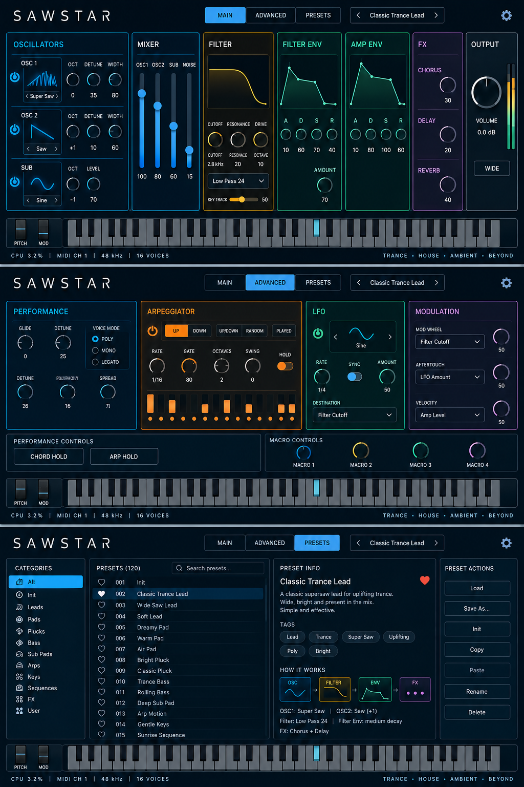

# SAWSTAR

**Simple Synth – Big Sound**

An open-source, saw-focused synthesizer for direct sound design and learning.
Built toward **iPlug2 + a custom SAWSTAR voice/synth engine + DaisySP primitives**,
with a custom [7-Saw unison layer](docs/SEVEN_SAW.md).

## Concept



*GUI concept — work in progress. The image shows the design vision, not an implemented plugin.*

## User presets

The PRESETS page now supports [named User preset files](docs/USER_PRESETS.md):
Save As, Load, User Library, Rename, recoverable Delete and Init.

## Master WIDE

The OUTPUT panel now offers [master stereo width](docs/MASTER_WIDTH.md), with
a smoothed switch and amount control. Older presets retain their original sound.

## Modular GUI

The working editor now has a 1280 × 760 modular layout: tinted MAIN headers,
uniform blue ADVANCED panels, and a factory preset learning page. The white logo,
tabs, preset selector, keyboard, wheels and status strip stay fixed across pages.
See [GUI implementation and validation](docs/GUI_IMPLEMENTATION.md) for controls,
known differences from the artwork and host-check coverage.

## Status: First Sound development build / 0.1.0-dev

The iPlug2 VST3 now includes a custom 16-voice SAWSTAR engine using DaisySP's
polyBLEP saw primitives and Amp ADSR, velocity, sustain pedal and stereo 7-Saw output.
MAIN / ADVANCED / PRESETS share a slim, clickable 61-key keyboard (MIDI 36–96)
with cyan note feedback. There is no octave selector; the DAW can send all 128 notes.
The original five IDs remain unchanged; Detune, Mix and Width append three new IDs.
Versioned state reads older saves. Raise Mix above 0% to hear 7-Saw.
A [resonant stereo low-pass](docs/FILTER.md) adds Cutoff, Resonance and Filter Mix.
Raise Filter Mix above 0% to engage filtering.

[Build and test](docs/PLUGIN_SHELL.md). GitHub Actions builds macOS ARM64 and
Windows x64 development archives and runs engine tests plus the VST3 validator.
The concept above is the longer-term design, not a screenshot of this build.
The fixed header now offers a eight-sound [factory preset library](docs/PRESETS.md),
previous/next arrows and a dropdown, with short learning notes on the PRESETS page.
Edited sounds show as Custom and are saved with the DAW project.
This is not a tagged release. Full host automation acceptance remains outstanding. The user reported successful Windows manual testing of an
earlier build; each subsequent build also receives automated Windows validation.

## First milestone: `v0.1 First Sound`

- [ ] VST3 loads and plays in REAPER on macOS and Windows.
- [x] Three-tab shell: MAIN, ADVANCED, PRESETS.
- [ ] MIDI input, including sample offsets and note-on velocity zero.
- [x] Fixed-capacity polyphonic SAWSTAR voice manager.
- [x] One bandlimited saw oscillator per voice, velocity and Amp ADSR.
- [ ] Stereo output with conservative gain and parameter smoothing.
- [ ] Versioned state save/recall and host automation.

The acceptance procedure is in [docs/MILESTONES.md](docs/MILESTONES.md).

## Build the foundation

Requires CMake 3.21+, Git and a C++17 toolchain: Xcode/Command Line Tools on
macOS, or Visual Studio 2022 with Desktop development with C++ on Windows.
Review and accept the Xcode license yourself when required by Apple.

```sh
git clone https://github.com/RobCZart82/SAWSTAR.git
cd SAWSTAR
cmake -S . -B build -DBUILD_TESTING=ON
cmake --build build --config Release
ctest --test-dir build -C Release --output-on-failure
```

The default build is offline after clone and builds `sawstar_foundation` only.
To compile and test the two selected DaisySP primitives as well:

```sh
git submodule update --init third_party/DaisySP
cmake -S . -B build-dsp -DBUILD_TESTING=ON -DSAWSTAR_CHECK_DAISYSP=ON
cmake --build build-dsp --config Release
ctest --test-dir build-dsp -C Release --output-on-failure
```

For future plugin work, initialize iPlug2 with
`git submodule update --init third_party/iPlug2`.
Do not use recursive initialization: DaisySP-LGPL is deliberately excluded.
No SDK download scripts run automatically. See [BUILDING.md](docs/BUILDING.md).

## Design

| Tab | Purpose |
| --- | --- |
| MAIN | Sound design and visible signal flow |
| ADVANCED | Performance, arpeggiator and modulation |
| PRESETS | Library, discovery and learning |

- [Concept](docs/CONCEPT.md)
- [Architecture and real-time boundaries](docs/ARCHITECTURE.md)
- [Parameter and state contract](docs/PARAMETERS.md)
- [GUI reference slot](docs/reference/README.md)
- [Dependency versions and licensing](docs/THIRD_PARTY.md)

`src/plugin` adapts the host; `src/engine` owns synthesis; `src/dsp` wraps
primitives; `src/midi` handles musical events; `src/presets` owns persistence;
`src/gui` presents parameters. Reserved folders have a README documenting their
purpose instead of dummy implementations.

## License

Original SAWSTAR code and documentation: [MIT](LICENSE), copyright SAWSTAR
contributors. Third-party components retain their own licenses. iPlug2 uses a
zlib-style license; the selected DaisySP core uses MIT. The optional LGPL
extension is not part of this build. See [THIRD_PARTY_NOTICES.md](THIRD_PARTY_NOTICES.md).
Artwork, fonts and external presets must have recorded redistribution rights
before being added; the concept image is included as a design reference.

The filter now includes an independent per-voice ADSR, bipolar envelope amount
and keyboard tracking. See [filter modulation](docs/FILTER_MODULATION.md).

Pitch bend and CC1 now work per MIDI channel, with shared on-screen wheels
and ADVANCED depth controls. See [performance controls](docs/PERFORMANCE.md).

The [four-source mixer and output calibration](docs/SOURCE_MIXER.md) add an
independent OSC2, sine SUB and White/Dark Noise. New sounds use +18 dB Level
Boost with stereo peak protection; old project levels are preserved.

[Filter Drive and four filter modes](docs/FILTER_CHARACTER.md) now provide
LP12, LP24, HP12 and BP12. Raise Filter Mix to engage them; existing projects
retain undriven LP12 until changed.

[Oscillator waveform previews and LFO routing](docs/LFO_WAVEFORMS.md) add
independent Saw/Square/Triangle/Sine selection plus an ADVANCED LFO with
free/tempo rate, first-key retrigger and Cutoff/Pitch/Amp/Pan destinations.

Stereo chorus is available on ADVANCED (Off by default). See [chorus](docs/CHORUS.md).

Stereo/ping-pong delay is available on ADVANCED (Off by default). See [delay](docs/DELAY.md).

Stereo reverb is available in ADVANCED → REVERB (Off by default). See [reverb](docs/REVERB.md).

Mono/Legato and Glide are available on ADVANCED. See [performance modes](docs/MONO_GLIDE.md).

Noise: White, Dark and Pink sources are available in MAIN's mixer, with an
independent bipolar NOISE COLOR control (0 = original source). Existing presets
retain their White/Dark source and neutral color.

ADVANCED now includes two independent LFOs with a shared LFO 1 / LFO 2 editor,
and four source/destination/amount modulation rows. New routes are disabled by
default. See [Modulation](docs/MODULATION.md) for controls and compatibility.

ADVANCED → ARP now includes five patterns, tempo-synced rate, gate, octaves,
swing and Hold. It is disabled in existing presets. See
[Arpeggiator](docs/ARPEGGIATOR.md) for playing and transport behavior.
